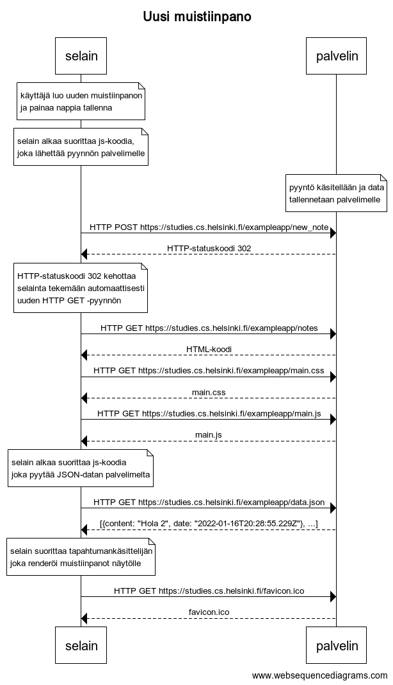
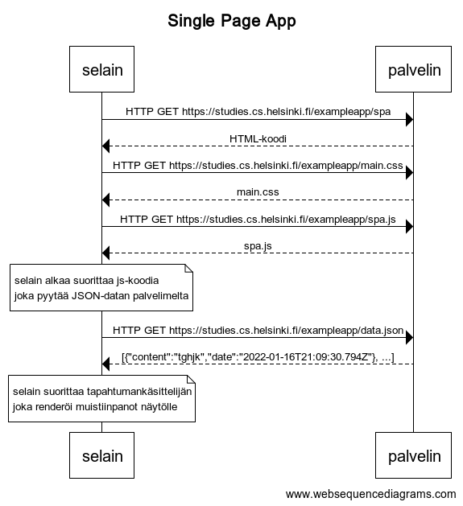
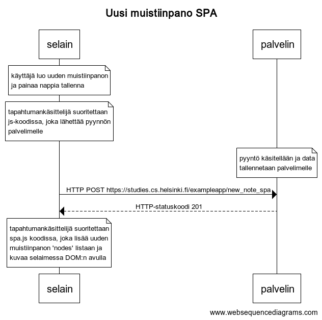

# Osan 0 tehtävien vastaukset

## 0.4: Uusi muistiinpano



```
title Uusi muistiinpano

note over selain:
käyttäjä luo uuden muistiinpanon
ja painaa nappia tallenna 
end note

note over selain:
selain alkaa suorittaa js-koodia,
joka lähettää pyynnön palvelimelle
end note

note over palvelin:
pyyntö käsitellään ja data
tallennetaan palvelimelle
end note

selain->palvelin: HTTP POST https://studies.cs.helsinki.fi/exampleapp/new_note
palvelin-->selain: HTTP-statuskoodi 302

note over selain:
HTTP-statuskoodi 302 kehottaa
selainta tekemään automaattisesti
uuden HTTP GET -pyynnön
end note

selain->palvelin: HTTP GET https://studies.cs.helsinki.fi/exampleapp/notes
palvelin-->selain: HTML-koodi
selain->palvelin: HTTP GET https://studies.cs.helsinki.fi/exampleapp/main.css
palvelin-->selain: main.css
selain->palvelin: HTTP GET https://studies.cs.helsinki.fi/exampleapp/main.js
palvelin-->selain: main.js

note over selain:
selain alkaa suorittaa js-koodia
joka pyytää JSON-datan palvelimelta
end note

selain->palvelin: HTTP GET https://studies.cs.helsinki.fi/exampleapp/data.json
palvelin-->selain: [{content: "Hola 2", date: "2022-01-16T20:28:55.229Z"}, ...]

note over selain:
selain suorittaa tapahtumankäsittelijän
joka renderöi muistiinpanot näytölle
end note

selain->palvelin: HTTP GET https://studies.cs.helsinki.fi/favicon.ico
palvelin-->selain: favicon.ico
```

## 0.5: Single Page App



```
title Uusi muistiinpano SPA

note over selain:
käyttäjä luo uuden muistiinpanon
ja painaa nappia tallenna 
end note

note over selain:
Tapahtumankäsittelijä suoritettaan 
js-koodissa, joka lähettää pyynnön 
palvelimelle
end note

note over palvelin:
pyyntö käsitellään ja data
tallennetaan palvelimelle
end note

selain->palvelin: HTTP POST https://studies.cs.helsinki.fi/exampleapp/new_note_spa
palvelin-->selain: HTTP-statuskoodi 201

note over selain:
Tapahtumankäsittelijä suoritettaan
spa.js koodissa, joka lisää uuden 
muistiinpanon 'nodes' listaan ja kuvaa
selaimessa DOM:n avulla
end note
```

## 0.6: Uusi muistiinpano



```
title Uusi muistiinpano SPA

note over selain:
käyttäjä luo uuden muistiinpanon
ja painaa nappia tallenna 
end note

note over selain:
tapahtumankäsittelijä suoritettaan 
js-koodissa, joka lähettää pyynnön 
palvelimelle
end note

note over palvelin:
pyyntö käsitellään ja data
tallennetaan palvelimelle
end note

selain->palvelin: HTTP POST https://studies.cs.helsinki.fi/exampleapp/new_note_spa
palvelin-->selain: HTTP-statuskoodi 201

note over selain:
tapahtumankäsittelijä suoritettaan
spa.js koodissa, joka lisää uuden 
muistiinpanon 'nodes' listaan ja 
kuvaa selaimessa DOM:n avulla
end note
```